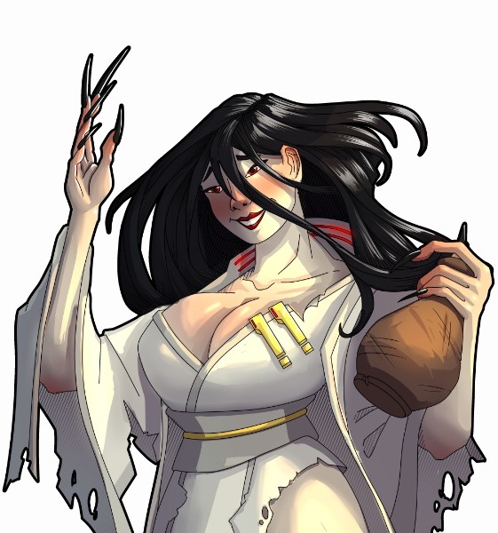
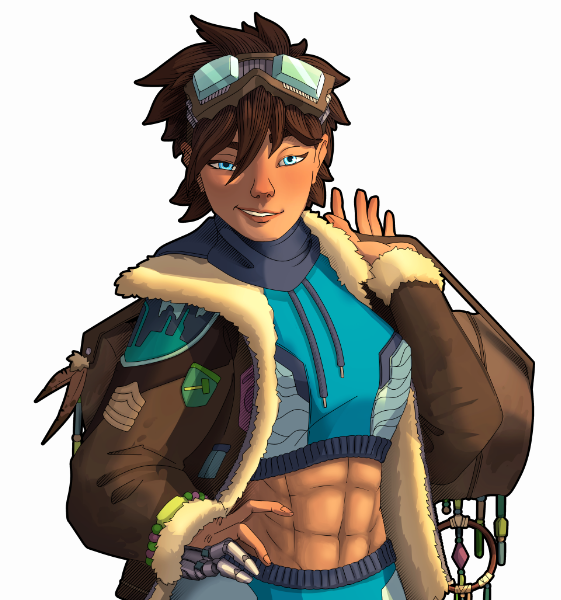

# Yaoma Storytellers (Standalone)
## Introduction

Residing primarily in the globular star cluster known as **The Tianting**, the **Yaoma** are a group of hermaphroditic xenohumans closely related to and otherwise visually indistinguishable from baseliners. They originated from a prosperous glitterworld, designed by the first of them: their mythologized hero-king known as **Ku**. From their **Jade Progenitor**, they have received a sacred mission to ensure greater humanity’s survival against the archotechs. Whether said mission is warranted- another story.

Among them are those that have traversed the full breadth of **Yaoma cultivation**, a psycho-transhumanist method for transcendence of the human mind and body. They are known as **immortals**. **Immortals** represent the most honored and powerful of the **Yaoma**, capable of altering the natural world with their comprehension of the **Dao**, a metaphysical gestalt schema managed by the xenotype. By applying said laws with the usage of **qi**, the motive force of the universe, the **Jade Sisters** hope to stand against the transcendent machines.

Of these **immortals**, at least three of them have more than a passing interest in storytelling. Their experiences, comprehensions, and capabilities shape the tales that they tell to such an extent that natural law bends to them.

Survive their challenges, and you just may seize victory against the archotechs.

## Storytellers
### Farseer Fan

  

*“Follow, divert, resist your flowing time- let the stars witness your fate.”*

**Farseer Fan** will grant you visions of the future to come: you'll know what incidents will occur in advance. In exchange, she only asks to challenge you, increasing the difficulty of negative events as well as the frequency of incidents in general. Such is the price of knowing capricious fate, as the stars decreed.

### Kaiyi the Karmic

  

*“Significant customer lifetime value. Expect new capital.”*

If he isn’t delivering destiny, **Kaiyi the Karmic** will offer a chance to control your fate. Doing so requires karma, which can be gained from most negative events and spent on neutral as well as positive incidents. After each trade, the event choices are affected by your karma, and their prices by demand. 

As part of his agreement with you, **Kaiyi** reserves the right to increase incident frequency and the prevalence of negative events; otherwise, he lets fate run its chaotic, random course. Take care not to become a debtor, lest he employs some… reconciliation services.

### Deathless Daji

  

*“Courting death? I married her!”*

**Deathless Daji** will resurrect all corpses at the end of the day- why should death be the end of all things? That doesn’t mean no risks, though: every resurrection she performs rots revived pawns with the dreaded **Crimson Psychosis**, maiming their mental stability. At full mind-blight, they’ll become berserk husks for eternity. 

Beyond that, he is a fervent believer of living in the moment, throwing in whatever event catches her fancy.

### Jianghu Jin

  

*“Another world, another horizon!”*

**Jianghu Jin’s** travels have enlightened her on the marvels of many natural landscapes. At regular intervals, she will transform the map to display the majesty of the planet. She also understands the significance of home, and will largely keep indoor rooms intact as well as provide a boon to pawn construction and mining speed.

**Jin** does not concern herself with altering events or tampering with chance, letting incidents occur randomly.

## Additional Lore

These **immortals** have a history of their own: maybe you'd like to [learn a little more about them][1]?

[1]: https://docs.google.com/document/d/19WIH7BcWehoxbG7uY0EXuX1a2iqLclrPWvmkELolcEk/edit?usp=sharing

## FAQ

* **Can I use the code in here?** Go for it, preferably with credit!

* **I don't like some of the mechanics here. What can I do about them?** You'll want to look in the mod settings- you can alter base mechanics.

* **Look, this is nice and all, but is there anything else to these storytellers?** All storytellers have additional bonus mechanics. By default they are disabled, but can be enabled within mod settings. These additional mechanics include the following:
   - **Farseer Fan**: alternative and deferred incident predictions.
   - **Kaiyi the Karmic**: karma incident point scaling and incident catalog rerolls.
   - **Deathless Daji**: lifesteal on melee attacks and **Crimson Psychosis** severity decrease on kills.
   - **Jianghu Jin**: map biome change (limited and unlocked) and hilliness alteration on terraforming.

* **Is there a race mod associated with this? Am I missing out on something?** No, you aren't missing anything. Originally, the storytellers were meant to accompany a race mod. But because of their level of polish compared to the rest of the mod at the time, I've opted to put the storytellers into their own standalone mod.

## Credits
My warmest thanks go to:
* **Vex**, for the incredible art of Farseer Fan and Kaiyi the Karmic.
* **Visandar_the_Unliving**, for his heart-stopping depiction of Deathless Daji and charming art of Jianghu Jin.
* **Gouda quiche**, for his storyteller balance, C#, and mod setting advice.
* **Feldoh**, for his expertise in C# and help in polishing storyteller design.
* **Fraudecon, Argon, and Sovereign**, for listening to my ramblings.
* **Elseud** and **TheCatLover366**, for aiding in editing descriptions and lore.
* **Aelanna** and **Smartkar**, for their suggestions on improving Jianghu Jin's design.

And many others within the RimWorld community for their support!
 
